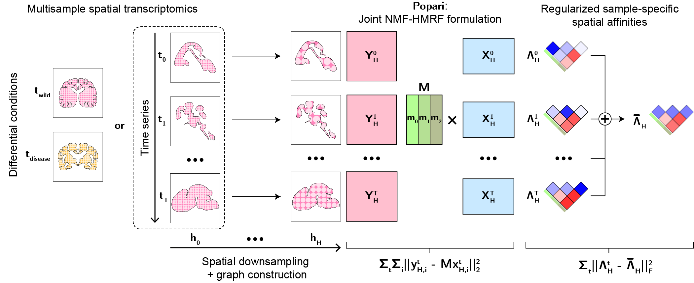

# Popari

Popari is a versatile framework for joint analysis and investigation of complex spatial transcriptomics datasets. Read the documentation (including installation instructions) [here](https://popari.readthedocs.io/en/latest/).

> :warning: **Popari is still under active development.** Check back in a bit for a more complete user experience!

<p align="center">
  
</p>

## Dev instructions

For development, create a fresh Python environment; this should not contain the PyPI-published
version of the package.

### PyPI publishing

```
pip install hatch
pip install keyrings.alt

hatch build
hatch publish -r https://upload.pypi.org/legacy/
```

Username: `__token__`
Password: `{API token for PyPI}`

### Running `pytest` tests

To run the provided tests and ensure that Popari can run on your platform, follow the instructions below:

- Install `pytest` in your environment.

```console
pip install pytest
```

- Navigate to the root directory of this repo, and run all tests with

```console
python -m pytest -s
```

- Alternatively, run a single test suite as below:

```console
python -m pytest -s tests/test_popari_shared.py
```

- To run tests in parallel, try

```console
python -m pytest -n 4 --dist=loadfile
```

### Building Documentation

Assuming you have CMake:

1. Navigate to `docs/`.

```console
cd docs/
```

2. Install Sphinx requirements.

```console
pip install -r requirements.txt
```

3. Clean and build.

```console
make clean
make html
```

4. Push to GitHub, and documentation will automatically build.
