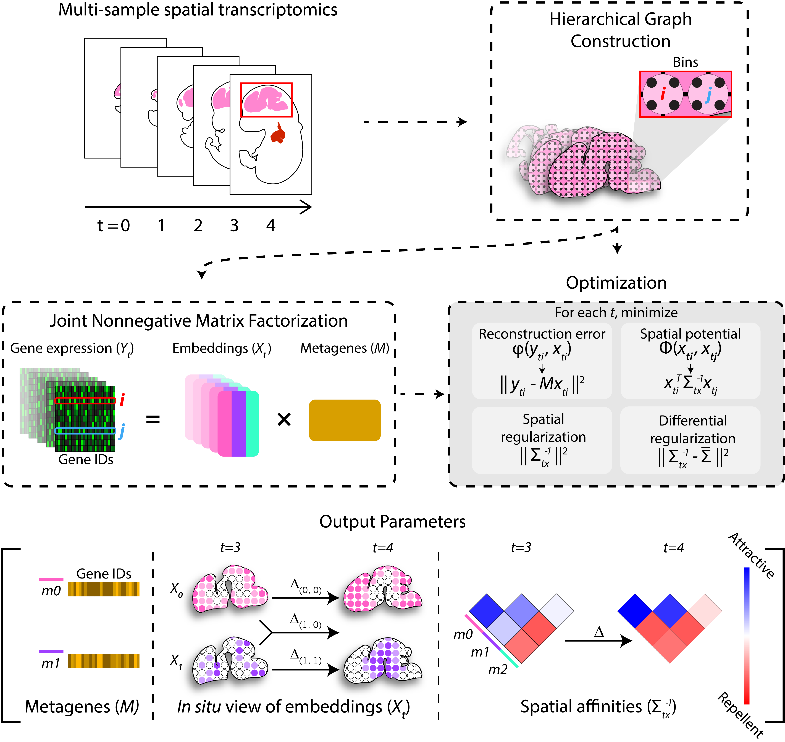

# Popari


Popari is a versatile framework for joint analysis and investigation of complex spatial transcriptomics datasets. Read the documentation (including installation instructions) [here](https://popari.readthedocs.io/en/latest/).

> :warning: **Popari is still under active development.** Check back in a bit for a more complete user experience!

<p align="center">
  
</p>

## Dev Instructions
### Install

```
pip install popari
```

### Publishing

```
pip install hatch
pip install keyrings.alt

hatch build
hatch publish
```
Username: `__token__`
Password: `{API token for PyPI}`

### Tests

To run the provided tests and ensure that SpiceMix can run on your platform, follow the instructions below:

- Download this repo.
```console
git clone https://github.com/alam-shahul/SpiceMixPlus.git
```
- Install `pytest` in your environment.
```console
pip install pytest
```
- Navigate to the root directory of this repo.
- Run the following command. With GPU resources, this test should execute without errors in ~2.5 minutes:
```console
python -m pytest -s tests/test_popari_shared.py
```
### Building Documentation

Assuming you have CMake:

1. Navigate to `docs/`.
```console
cd docs/
```
2. Install Sphinx requirements.
```console
pip install -r requirements.txt
```
3. Clean and build.
```console
make clean
make html
```
4. Push to GitHub, and documentation will automatically build.
